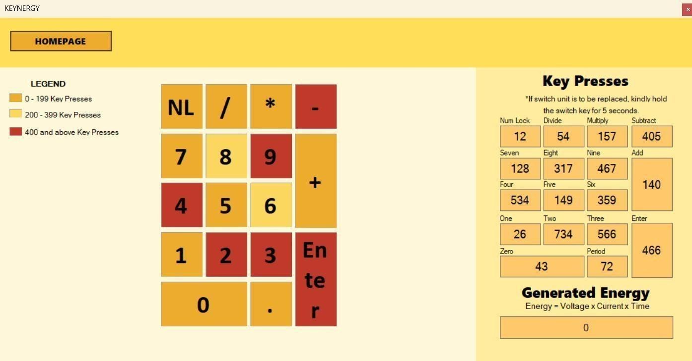

# 🎓 **KEYNERGY: Solenoid-Based Energy-Harvesting Custom Mechanical Keyboard**

**A novel solenoid-based mechanical keyboard that converts mechanical energy from keypresses into electrical energy via electromagnetic induction, validated through a functional prototype and real-time monitoring GUI.**

---

## 💡 Overview and Motivation

### The Problem

The growing demand for sustainable technology requires innovative solutions for powering ubiquitous input devices. Conventional peripherals rely entirely on grid power or disposable batteries, contributing to energy consumption and e-waste.

### Our Solution

We developed **Keynergy**, a functional prototype of a **solenoid-based energy-harvesting mechanical keyboard**. The system uses custom solenoid switches with N52-grade neodymium magnets to convert mechanical energy from keypresses into electrical energy via electromagnetic induction. This harvested energy is stored using a capacitor and a lithium-ion battery.

### Key Contributions

1.  **Novel Solenoid Switch Design:** Optimized for energy generation without compromising tactile feedback.
2.  **Energy Storage System:** Enables storage and utilization of harvested energy to power low-power devices.
3.  **Real-Time Graphical User Interface (GUI):** Provides immediate user feedback on keypress activity and energy generation.

---

## 🖥️ Graphical User Interface (GUI)

The real-time Graphical User Interface (GUI) is a core component of Keynergy, allowing users to monitor keypress frequency and energy generation.

### Keynergy Main Page

The main page is divided into two sections: **Pressed Keys** (the numerical pad) and **Key Presses & Generated Energy** (the right panel).



* **Color-Coded Feedback:** The numeric pad provides immediate, visual feedback on usage intensity. Keys change color based on the number of keypresses:
    * **Light Orange:** 0 – 199 Key Presses
    * **Light Yellow:** 200 – 399 Key Presses
    * **Light Red:** 400 and above Key Presses
* **Real-Time Data:** The right panel displays the exact number of keypresses for each key, along with the **Generated Energy** calculation in real-time.

## 📺 Video Summary

Watch our video presentation for a demonstration of the **Keynergy** prototype, a breakdown of the energy-harvesting mechanism, and a live view of the GUI in action!

➡️ **[WATCH THE KEYNERGY THESIS VIDEO HERE](https://www.youtube.com/your-video-link)** ⬅️

---

## 🔬 Experimental Results

| Feature / Metric | Result | Description |
| :--- | :--- | :--- |
| **Tactile Feedback** | Weighted Mean of **3.49** | User survey confirms acceptable tactile experience compared to conventional switches. |
| **GUI Effectiveness** | Weighted Mean of **3.88** | User survey indicates strong agreement that the GUI provides effective feedback. |
| **LED Illumination** | **25–30 presses** required | The minimum number of presses required to illuminate a low-power LED. |
| **Sustained Power** | LED remains lit for **10.83 seconds** (average) | The duration a low-power LED remains illuminated after initial charging. |
| **Feasibility** | **Validated** | Prototype successfully proves the feasibility of electromagnetic energy harvesting in input devices. |

---

## 💻 Project Structure

This repository is organized into the following key directories:

| Directory | Content |
| :--- | :--- |
| **`/data`** | Contains scripts to download/generate the datasets (e.g., keypress usage patterns). |
| **`/code`** | The main source code for the prototype firmware, circuit control logic, and the GUI implementation. |
| **`/models`** | Saved models or simulation outputs. |
| **`/report`** | The final thesis document, including the Introduction, Methodology, Results, and Conclusion. |
| **`/figures`** | All images, charts, and visualizations used in the final report, including the GUI image. |

---

## 🛠️ Setup and Installation

*Steps on how to reproduce the hardware setup, load the microcontroller code, or run the GUI application should go here.*

### 1. Prerequisites

* **Python** (version **\[3.x.x]**) for the GUI
* **\[Microcontroller IDE, e.g., Arduino IDE, PlatformIO]** for firmware
* **Git**

### 2. Cloning the Repository

```bash
git clone [https://github.com/YourGitHubUsername/KeynergyThesis.git](https://github.com/YourGitHubUsername/KeynergyThesis.git)
cd KeynergyThesis
```

### 3. Cloning the Repository
```bash
# 1. Install dependencies
pip install -r requirements.txt

# 2. Run the main application
python code/gui/main_keynergy_gui.py

```
